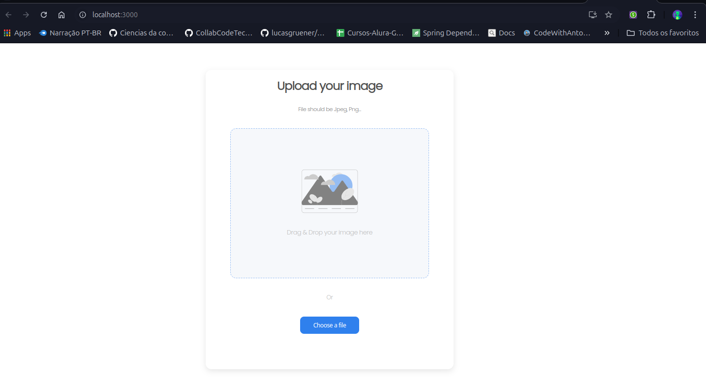
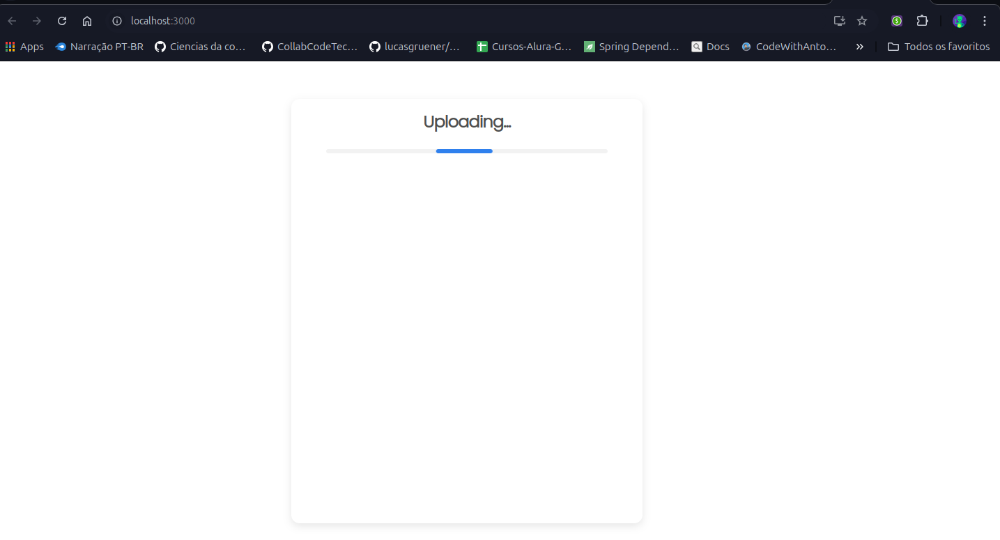

# Image Uploader

## About

The Image Uploader project is a full-stack application designed to allow users to upload and view images seamlessly. This project was created as part of a coding challenge, demonstrating the integration of a React frontend with a backend server (source code available [here](https://github.com/MoDasby/image-uploader-backend))

## Captures

## Technologies

this project was built using React